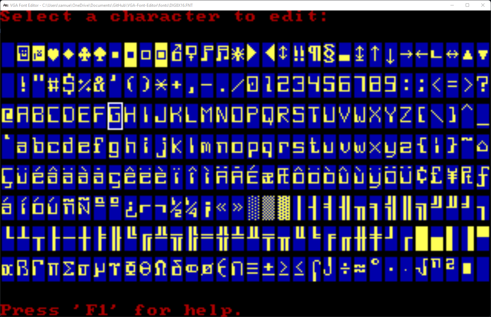

# What is this?

This is an editor and creator for VGA ROM fonts. This also has code for rendering text using a loaded font. The source is written in QB64 and works natively without using any third party libraries.




## What is a VGA ROM font?

These are fonts embedded in the VGA ROM BIOS. To learn more about VGA ROM fonts see

- [VGA Fonts](https://wiki.osdev.org/VGA_Fonts)
- [VGA ROM Fonts](http://www.alexandrugroza.ro/microelectronics/essays-research/vga-rom-fonts/index.html)
- [romfont](https://github.com/spacerace/romfont)

## How is a character stored in memory?

It's quite simple, 0 encodes background, 1 encodes foreground color. VGA fonts are always 8 bits wide so that each byte contains exactly one row. For letter 'A' in the typical 8x16 font it would be (in binary):

```
00000000b  byte  0
00000000b  byte  1
00000000b  byte  2
00010000b  byte  3
00111000b  byte  4
01101100b  byte  5
11000110b  byte  6
11000110b  byte  7
11111110b  byte  8
11000110b  byte  9
11000110b  byte 10
11000110b  byte 11
11000110b  byte 12
00000000b  byte 13
00000000b  byte 14
00000000b  byte 15
```

The full bitmap contains bitmaps for every character, thus it's 256*16 bytes, 4096 bytes long (for 8x16 fonts). If you want to get the bitmap for a specific character, you have to multiply the ASCII code by 16 (number of rows in a character for 8x16 fonts).

## What are these FNT files?

These font are created using the VGA font editor tool or the bin2fnt conversion tool. These files are extemely small suitable for embedded, memory limited or retro projects. The file itself is almost a raw dump of the VGA ROM font with just 5 bytes for the header.

```
               FONT FILE FORMAT
+--------------------------------------------+
| "FONT" (4 bytes)                           |
+--------------------------------------------+
| FONT HEIGHT (1 byte)                       |
+--------------------------------------------+
| CHAR 1 SCAN LINE 1 (1 byte)                |
| CHAR 1 SCAN LINE 2 (1 byte)                |
| CHAR 1 SCAN LINE 3 (1 byte)                |
| CHAR 1 SCAN LINE 4 (1 byte)                |
| CHAR 1 SCAN LINE 5 (1 byte)                |
|                    ..                      |
|                    ..                      |
|                    ..                      |
| CHAR 1 SCAN LINE <FONT HEIGHT>  (1 byte)   |
+--------------------------------------------+
| CHAR 2 SCAN LINE 1 (1 byte)                |
| CHAR 2 SCAN LINE 2 (1 byte)                |
| CHAR 2 SCAN LINE 3 (1 byte)                |
| CHAR 2 SCAN LINE 4 (1 byte)                |
| CHAR 2 SCAN LINE 5 (1 byte)                |
|                    ..                      |
|                    ..                      |
|                    ..                      |
| CHAR 2 SCAN LINE <FONT HEIGHT>  (1 byte)   |
+--------------------------------------------+
|                    ..                      |
|                    ..                      |
|                    ..                      |
+--------------------------------------------+
|                    ..                      |
|                    ..                      |
|                    ..                      |
+--------------------------------------------+
|                    ..                      |
|                    ..                      |
|                    ..                      |
+--------------------------------------------+
| CHAR 256 SCAN LINE 1 (1 byte)              |
| CHAR 256 SCAN LINE 2 (1 byte)              |
| CHAR 256 SCAN LINE 3 (1 byte)              |
| CHAR 256 SCAN LINE 4 (1 byte)              |
| CHAR 256 SCAN LINE 5 (1 byte)              |
|                    ..                      |
|                    ..                      |
|                    ..                      |
| CHAR 256 SCAN LINE <FONT HEIGHT>  (1 byte) |
+--------------------------------------------+
```

## What can I do with this?

Anything you want! You may use the file format or sourcecode for embedded, retro, game projects and more. This does not require you to have DOS or any old PC hardware. All code here is written for modern hardware. The font file format is super simple and the text rending code is straightforward and clean. With very little effort, the rendering code can be ported to your favorite language and library. There are many example fonts in the `fonts` directory. I honest do not know the orginal souces of these and highly recommend you create your own fonts using the tool for your projects.

| File | Function | Description |
|------|----------|-------------|
|**[editfont.bas](https://github.com/a740g/VGA-Font-Editor/blob/main/EDITFONT.BAS)** | DrawCharacter() | QB64 - Draws a glyph  |
|**[editfont.bas](https://github.com/a740g/VGA-Font-Editor/blob/main/EDITFONT.BAS)** | DrawString() | QB64 - Draws a string of text |
|**[editfont.bas](https://github.com/a740g/VGA-Font-Editor/blob/main/EDITFONT.BAS)** | ReadFont() | QB64 - Reads a font file from disk |
|**[editfont.bas](https://github.com/a740g/VGA-Font-Editor/blob/main/EDITFONT.BAS)** | WriteFont() | QB64 - Writes a font file to disk |
|**[graphics.cpp](https://github.com/a740g/gFrame/blob/master/GRAPHICS.CPP)** | Font::Load() | C++ (DOS) - Load a font file from disk |
|**[graphics.cpp](https://github.com/a740g/gFrame/blob/master/GRAPHICS.CPP)** | Graphics::Print() | C++ (DOS) - Draws a string of text (multi-direction) |
