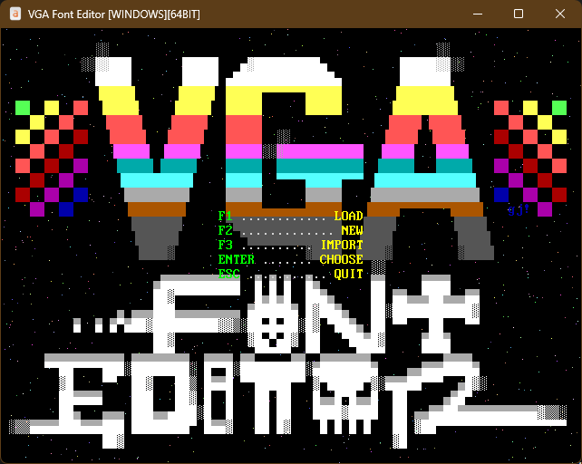

# VGA FONT EDITOR

This is a cross-platform editor and library for VGA ROM fonts. This has code for rendering text using a loaded font. The source code is written in [QB64-PE](https://github.com/QB64-Phoenix-Edition/QB64pe) and works natively without using any third party libraries.




## FEATURES

- No dependency on third party libraries
- Everything is statically linked (no shared library dependency)
- Easy plug-&-play API optimized for demos & games
- Cross-platform (works on Windows, Linux & macOS)
- Editor supports selecting and editing using the mouse

## USAGE

- Clone the repository to a directory of your choice
- Open Terminal and change to the directory using an appropriate OS command
- Run `git submodule update --init --recursive` to initialize, fetch and checkout git submodules
- Open *VGAFontEditor.bas* in the QB64-PE IDE and press `F5` to compile and run
- To use the library in your project add the [Toolbox64](https://github.com/a740g/Toolbox64) repositiory as a [Git submodule](https://git-scm.com/book/en/v2/Git-Tools-Submodules)

## API

```VB
' For rendering
FUNCTION PSF1_LoadFontFromMemory%% (buffer AS STRING, psf AS PSF1Type)
FUNCTION PSF1_LoadFontFromFile%% (fileName AS STRING, psf AS PSF1Type)
SUB PSF1_SetCurrentFont (psf AS PSF1Type)
FUNCTION PSF1_GetFontWidth~%%
FUNCTION PSF1_GetFontHeight~%%
FUNCTION PSF1_GetDrawStringWidth& (text AS STRING)
SUB PSF1_DrawCharacter (cp AS _UNSIGNED _BYTE, x AS LONG, y AS LONG)
SUB PSF1_DrawString (text AS STRING, x AS LONG, y AS LONG)

' Used by the editor
SUB PSF1_SetFontHeight (h AS _UNSIGNED _BYTE)
FUNCTION PSF1_GetFont$
FUNCTION PSF1_SetFont%% (buffer AS STRING)
FUNCTION PSF1_GetGlyphBitmap$ (cp AS _UNSIGNED _BYTE)
SUB PSF1_SetGlyphBitmap (cp AS _UNSIGNED _BYTE, bmp AS STRING)
FUNCTION PSF1_GetGlyphPixel%% (cp AS _UNSIGNED _BYTE, x AS LONG, y AS LONG)
SUB PSF1_SetGlyphPixel (cp AS _UNSIGNED _BYTE, x AS LONG, y AS LONG, b AS _BYTE)
SUB PSF1_SetGlyphDefaultBitmap (cp AS _UNSIGNED _BYTE)
FUNCTION PSF1_SaveFont%% (fileName AS STRING)
```

## FAQ

What can I do with this?

- Anything you want! You may use the file format or sourcecode for embedded, retro, game projects and more. This does not require you to have DOS or any old PC hardware. All code here is written for modern hardware. The font file format is super simple and the text rendering code is straightforward and clean. With very little effort, the rendering code can be ported to your favorite programming language and library. There are many example fonts in the `fonts` directory. I honestly do not know the orginal souces of these and highly recommend you to create your own fonts using this tool for your projects.

What is a VGA ROM font?

- These are fonts that are embedded in the VGA ROM BIOS. To learn more about VGA ROM fonts see:
  - [VGA Fonts](https://wiki.osdev.org/VGA_Fonts)
  - [VGA ROM Fonts](http://www.alexandrugroza.ro/microelectronics/essays-research/vga-rom-fonts/index.html)
  - [romfont](https://github.com/spacerace/romfont)

How is a character stored in memory?

- It's quite simple, 0 encodes background, 1 encodes foreground color. VGA fonts are always 8 bits wide so that each byte contains exactly one row. For letter 'A' in the typical 8x16 font it would be (in binary):

    ```text
    00000000b  byte  0
    00000000b  byte  1
    00000000b  byte  2
    00010000b  byte  3
    00111000b  byte  4
    01101100b  byte  5
    11000110b  byte  6
    11000110b  byte  7
    11111110b  byte  8
    11000110b  byte  9
    11000110b  byte 10
    11000110b  byte 11
    11000110b  byte 12
    00000000b  byte 13
    00000000b  byte 14
    00000000b  byte 15
    ```

    The full bitmap contains bitmaps for every character, thus it's 256*16 bytes, 4096 bytes long (for 8x16 fonts). If you want to get the bitmap for a specific character, you have to multiply the ASCII code by 16 (number of rows in a character for 8x16 fonts).

What are these PSF files?

- These PSFs ([PC Screen Font](https://en.wikipedia.org/wiki/PC_Screen_Font)) were created using the bin2psf conversion tool from raw VGA ROM font dumps from various sources. These files are extemely small and suitable for embedded, memory limited or retro projects. The files are almost a raw dump of the VGA ROM font with just a few bytes for the header.

    ```text
    +--------------------------------------------+
    | PSF1_MAGIC0 0x36 (1 byte)                  |
    +--------------------------------------------+
    | PSF1_MAGIC1 0x04 (1 byte)                  |
    +--------------------------------------------+
    | MODE (1 byte; set to 0)                    |
    +--------------------------------------------+
    | FONT HEIGHT (1 byte)                       |
    +--------------------------------------------+
    | CHAR 1 SCAN LINE 1 (1 byte)                |
    | CHAR 1 SCAN LINE 2 (1 byte)                |
    | CHAR 1 SCAN LINE 3 (1 byte)                |
    | CHAR 1 SCAN LINE 4 (1 byte)                |
    | CHAR 1 SCAN LINE 5 (1 byte)                |
    |                    ..                      |
    |                    ..                      |
    |                    ..                      |
    | CHAR 1 SCAN LINE <FONT HEIGHT>  (1 byte)   |
    +--------------------------------------------+
    | CHAR 2 SCAN LINE 1 (1 byte)                |
    | CHAR 2 SCAN LINE 2 (1 byte)                |
    | CHAR 2 SCAN LINE 3 (1 byte)                |
    | CHAR 2 SCAN LINE 4 (1 byte)                |
    | CHAR 2 SCAN LINE 5 (1 byte)                |
    |                    ..                      |
    |                    ..                      |
    |                    ..                      |
    | CHAR 2 SCAN LINE <FONT HEIGHT>  (1 byte)   |
    +--------------------------------------------+
    |                    ..                      |
    |                    ..                      |
    |                    ..                      |
    +--------------------------------------------+
    |                    ..                      |
    |                    ..                      |
    |                    ..                      |
    +--------------------------------------------+
    |                    ..                      |
    |                    ..                      |
    |                    ..                      |
    +--------------------------------------------+
    | CHAR 256 SCAN LINE 1 (1 byte)              |
    | CHAR 256 SCAN LINE 2 (1 byte)              |
    | CHAR 256 SCAN LINE 3 (1 byte)              |
    | CHAR 256 SCAN LINE 4 (1 byte)              |
    | CHAR 256 SCAN LINE 5 (1 byte)              |
    |                    ..                      |
    |                    ..                      |
    |                    ..                      |
    | CHAR 256 SCAN LINE <FONT HEIGHT>  (1 byte) |
    +--------------------------------------------+
    ```

## NOTES

- This requires the latest version of [QB64-PE](https://github.com/QB64-Phoenix-Edition/QB64pe/releases/latest)
- When you clone a repository that contains submodules, the submodules are not automatically cloned by default
- You will need to use the `git submodule update --init --recursive` to initialize, fetch and checkout git submodules

## ASSETS

- [ANSI Art](https://16colo.rs/artist/grymmjack) by [Rick Christy](https://github.com/grymmjack)
- [Icon](https://www.iconarchive.com/artist/umut-pulat.html) by [Umut Pulat](http://12m3.deviantart.com/)
